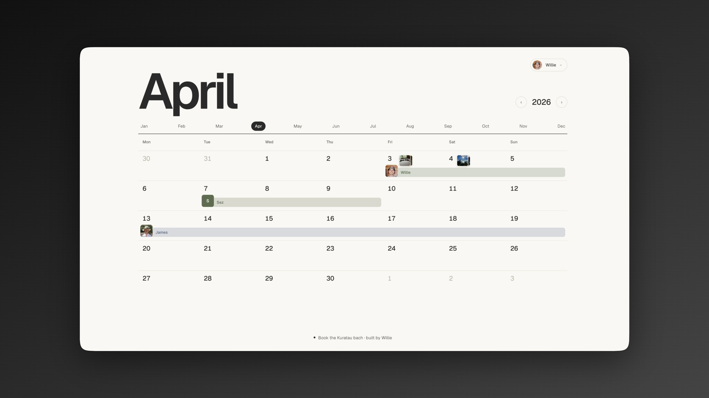

<p align="center">
  
</p>

<div align="center">

### A tiny, beautiful, and free to host booking calendar for the family holiday home.

[MIT licensed](./LICENSE) · built with Next.js, React, Drizzle, Neon, and Vercel Blob

</div>

<br>

A small app for sharing the family holiday home without turning the family chat into a booking tribunal: a private calendar with a shared PIN, optional stay costs, bank transfer details, photos from the trip, and just enough ceremony to keep everyone honest.

## What It Does

For families with a lakehouse, bach, cabin, cottage, or other beloved place that
people take turns using.

- Pick your identity, then claim dates on a spacious month calendar.
- Edit and delete your own stays — no global admin powers required.
- Optional nightly costs, bank details, and a transfer prompt at booking time.
- **Mary mode** — a quiet admin area where trusted users can tick off paid stays.
- Profile and stay photos when Vercel Blob is configured.
- Runs locally with demo data before you connect Neon.
- Rename the place, people, footer, PIN, colors, and cookie prefix to suit your own family.
- Agent-friendly: hand the codebase to an AI assistant, or run `/setup` (or `npm run setup`) to wire up database, storage, and family settings in one go.

Mary mode is named for my aunt Mary, who embodies the idea of an admin far
better than the word "admin" ever could.

<p align="center">
  <video src="https://github.com/user-attachments/assets/f2f57cec-b4b4-44c9-8c4e-e2e1d2f42a50" controls width="100%" muted playsinline></video>
</p>


## Simple Setup

If you have an AI coding assistant, type `/setup` in the chat. Otherwise run
the interactive wizard:

```bash
npm run setup
```

It checks the Vercel CLI, walks you through linking the Neon Postgres and Vercel
Blob integrations, pulls the connection strings down for you, prompts for your
family-specific settings (PIN, site title, nightly costs, bank details, admins),
and runs the initial schema push and seed.

Once it finishes, you're good to go.

---

### Manual Setup (Alternative)

If you prefer to configure the application manually:

1. Fork and clone this repo.
2. Create a [Vercel](https://vercel.com/pricing) project from your fork. The Hobby plan is a good starting point for personal use.
3. Add the [Neon integration for Vercel](https://vercel.com/marketplace/neon). It creates the Postgres database and wires the database environment variables for you. Neon's Free plan is fine for getting started.
4. Add the [Vercel Blob integration](https://vercel.com/docs/storage/vercel-blob) if you want profile photos and stay photos. Vercel handles the Blob environment variable too.
5. Add your app-specific settings from `.env.example`, especially `FAMILY_PIN` and the `NEXT_PUBLIC_*` display text.
6. Run `npm run db:push` once, then `npm run db:seed` to add starter people and sample bookings.

That is the whole shape of it: Vercel runs the app, Neon keeps the calendar, and
Blob stores the nice little photos.

## Local Development

For tinkering before deployment:

```bash
git clone https://github.com/shrimbly/book-the-lakehouse.git
cd book-the-lakehouse
npm install
cp .env.example .env.local
npm run dev
```

Open [http://localhost:3000](http://localhost:3000).

With only `.env.example` copied, the app can render with demo data. Add
`DATABASE_URL` when you are ready for real bookings to stick around.

## Environment Variables

Create `.env.local` in the project root:

Most of the database, Blob storage, and Vercel-specific values can be created
for you by the Vercel Neon and Vercel Blob integrations. Once they exist in
Vercel, pull them down locally with:

```bash
vercel env pull .env.local
```

Then add the app-specific bits, like `FAMILY_PIN`, display text, Marys, and any
optional stay-cost details.

```bash
FAMILY_PIN=1234
DATABASE_URL=postgres://...
BLOB_READ_WRITE_TOKEN=vercel_blob_rw_...

BOOKING_COST_PER_NIGHT=50
BOOKING_COST_CURRENCY=NZD
PAYMENT_ACCOUNT_NAME="Lakehouse Account"
PAYMENT_ACCOUNT_NUMBER="12-3456-7890123-00"
PAYMENT_REFERENCE="Lakehouse stay"
PAYMENT_NOTE="Please transfer after booking."
MARY_IDS=mary

NEXT_PUBLIC_HOME_NAME="Book the lakehouse"
NEXT_PUBLIC_SITE_DESCRIPTION="A private family booking calendar for the lakehouse."
NEXT_PUBLIC_FOOTER_TEXT="Book the lakehouse"
NEXT_PUBLIC_REPO_URL="https://github.com/shrimbly/book-the-lakehouse"
COOKIE_PREFIX=book-the-lakehouse
```

Only `FAMILY_PIN` is needed for the PIN gate. `DATABASE_URL` enables the real
database-backed calendar. `BLOB_READ_WRITE_TOKEN` enables photos.
`BOOKING_COST_PER_NIGHT` turns on the cost and bank-transfer prompt.
`MARY_IDS` is a comma-separated list of person IDs for Marys, the admin users
who can open `/mary` and check off paid stays.

## Database Setup

This project uses Drizzle with Neon Postgres.

```bash
npm run db:generate
npm run db:push
npm run db:seed
```

`src/lib/data.ts` contains the starter people and bookings used by both demo
mode and `npm run db:seed`. Swap them out for your own family, then seed again.

Run `npm run db:push` after pulling changes that add Mary mode, because bookings
include a persisted `payment_settled` checklist field.

Useful database commands:

```bash
npm run db:studio
```

## How It Is Organized

| Path | Purpose |
| --- | --- |
| `src/app/` | Next.js app route, metadata, and Server Actions. |
| `src/app/mary/` | Mary mode checklist view for tracking stay payments. |
| `src/components/` | Calendar, identity, PIN, photo, and month UI. |
| `src/db/` | Drizzle schema, client, queries, and seed script. |
| `src/lib/site.ts` | Reusable site branding and cookie configuration. |
| `src/lib/data.ts` | Demo and seed data for people and sample bookings. |

## Scripts

```bash
npm run dev          # Start the local Next.js dev server
npm run build        # Build for production
npm run start        # Run the production build
npm run lint         # Run ESLint
npm run db:generate  # Generate Drizzle migrations
npm run db:push      # Push schema changes to DATABASE_URL
npm run db:seed      # Seed people and bookings from src/lib/data.ts
```

## Tech Stack

| Tool | Why |
| --- | --- |
| Next.js 16 | App Router, Server Components, Server Actions, and metadata. |
| React 19 | Client interactions for picking, dragging, uploading, and editing. |
| Drizzle | Typed schema and query helpers for Postgres. |
| Neon | Serverless Postgres that deploys cleanly on Vercel. |
| Vercel Blob | Simple public image storage for profile and stay photos. |
| Tailwind CSS 4 | Quiet, responsive styling with a small custom palette. |

## Contributing

PRs are welcome, especially improvements that make the calendar easier for
another family to adopt. Keep it small, private-by-default, and friendly to
people who just want to book a weekend away without learning a new system.

## License

MIT. 
